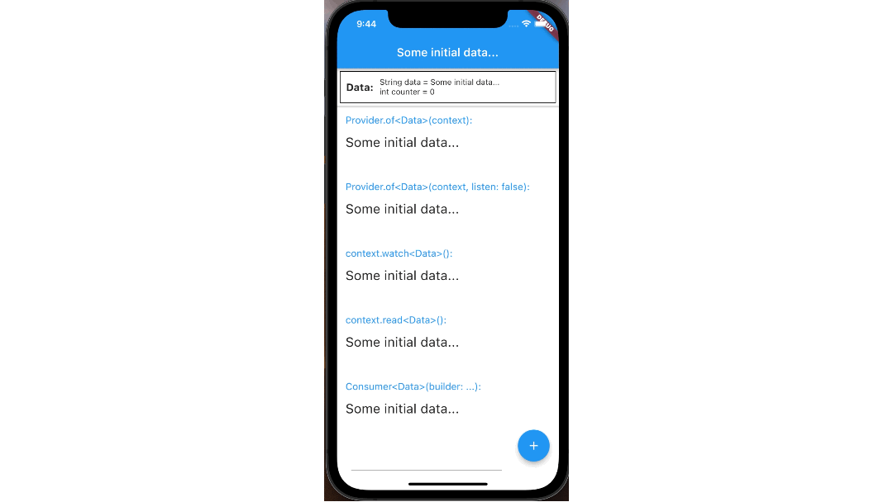

# practice_provider_package

## Training - A project made to practice State Management using the Provider Package





A simple data model is used, containing a String (`data`) and an integer (`counter`).

The following methods are used:
- To provide the data that needs to be shared:
  - ```dart
    final MyData data = MyData();

    ChangeNotifierProvider<MyData>.value(
      value: data,
      child: ...
    ```
- To retrieve the shared data and all of its updated values:
  - ```dart
    Provider.of<MyData>(context)
    ```
  - ```dart
    context.watch<MyData>(context)
    ```
  - ```dart
    Consumer<MyData>(
      builder: (context, myData, child) => //return a widget here,
    )
    ```
- To retrieve the shared data without being updated with new values:
  - ```dart
    Provider.of<MyData>(context, listen: false)
    ```
  - ```dart
    context.read<MyData>(context)
    ```
- To retrieve the shared data and its updated values, only if the selected part of the shared data has been updated:
  - ```dart
    Selector<MyData, int>(
      selector: (context, myData) => myData.counter,
      builder: (context, counter, child) => //return a widget here,
    )
    ```
  - ```dart
    int counter = context.select<MyData, int>((myData) => myData.counter);
    //you can use the counter here
    ```
